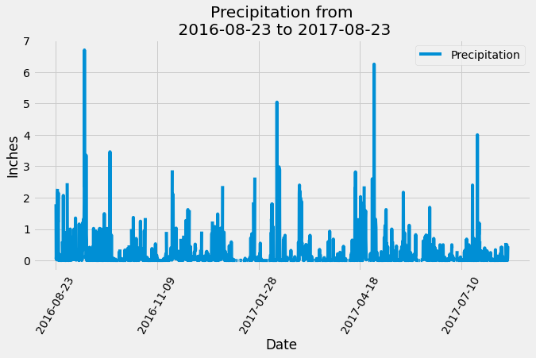

## Background

Tools Used: SQLAlchemy, Python, Flask app, Pandas 

Climate analysis on Honolulu, Hawaii. The following outlines steps taken to achieve this goal.

## Step 1 - Climate Analysis and Exploration

Incorparated the use of Python and SQLAlchemy to do basic climate analysis and data exploration of the climate database.

* Used the provided [starter notebook](climate_starter.ipynb) and [hawaii.sqlite](Resources/hawaii.sqlite) files to complete the climate analysis and data exploration.

* Used SQLAlchemy `create_engine` to connect to the sqlite database.

* Used SQLAlchemy `automap_base()` to reflect the tables into classes and saved a reference to those classes called `Station` and `Measurement`.

* Linked Python to the database by creating an SQLAlchemy session.

### Precipitation Analysis

* Started by finding the most recent date in the data set.

* From this date, retieved the last 12 months of precipitation data by querying the 12 preceding months of data.

* Loaded the query results into a Pandas DataFrame and set the index to the date column. (Sorted the DataFrame by new index)

* Displayed the results using the DataFrame `plot` method.

  

* Print the summary statistics for the precipitation data through the use of Pandas.

### Station Analysis

* Designed queries to calculate the total number of stations and to find the most acitve stations in the dataset.

  * Listed the stations and observation counts in descending order.

  * Using the most active station id, calculated the lowest, highest, and average temperature.

* Designed a query to retrieve the last 12 months of temperature observation data (TOBS).

  * Filtered by the station with the highest number of observations.

  * Queried the last 12 months of temperature observation data for this station.

  * Displayed a histogram with `bins=12`.

    

* Closed out the running session.

- - -

## Step 2 - Climate App

After completing the initial analysis, designed a Flask API based on the queries developed.

### Routes

* `/`

  * Home page.

  * Listed all routes available.

* `/api/v1.0/precipitation`

  * Converted the query results into a dictionary using `date` as the key and `prcp` as the value.

  * Returned the JSON representation of the dictionary.

* `/api/v1.0/stations`

  * Returned a JSON list of stations from the dataset.

* `/api/v1.0/tobs`
  * Queried the dates and temperature observations of the most active station for the last year of data.

  * Returned a JSON list of temperature observations (TOBS) for the previous year.

* `/api/v1.0/<start>` and `/api/v1.0/<start>/<end>`

  * Returned a JSON list of the minimum temperature, the average temperature, and the max temperature for a given start or start-end range.

  * When given the start only, calculated `TMIN`, `TAVG`, and `TMAX` for all dates greater than and equal to the start date.

  * When given the start and the end date, calculated the `TMIN`, `TAVG`, and `TMAX` for dates between the start and end date inclusive.
